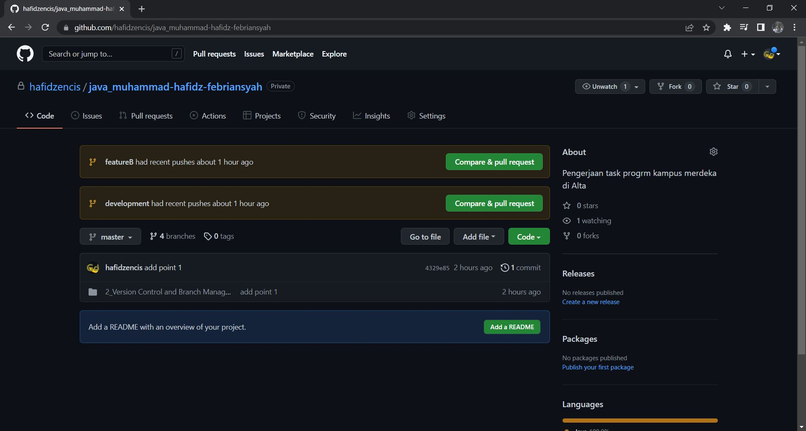
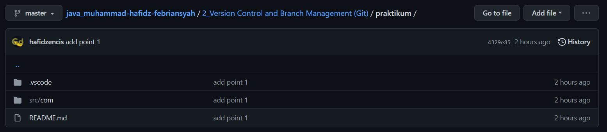
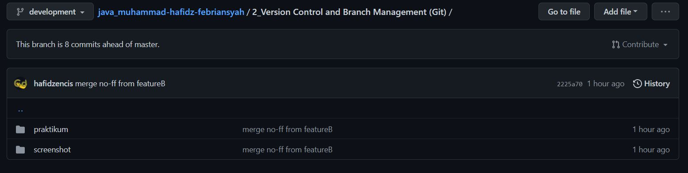
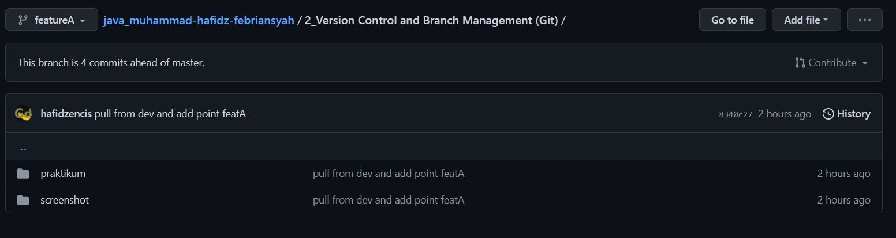
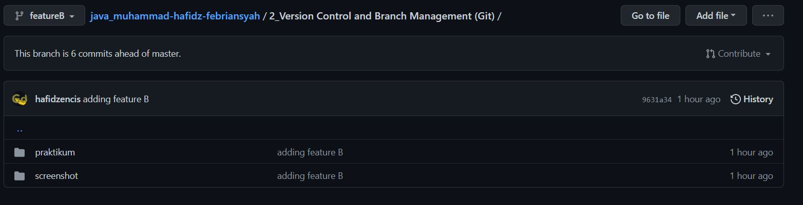
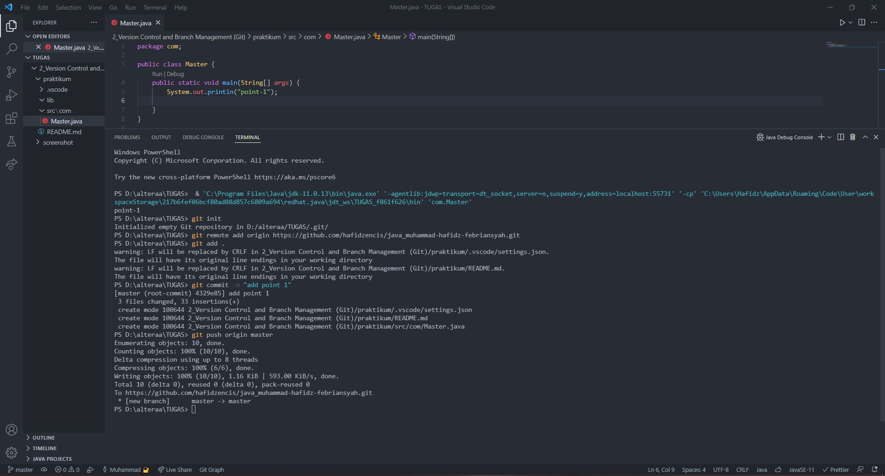

# 2_Version Control and Branch Management (Git)

## Resume

Dalam materi ini, mempelajari :
1.Pengertian VCS
2.Tools yang digunakan untuk melakukan VCS
3.Perintah dasar GIT

### Pengertian VCS

VCS (version control sytem) ini digunakan untuk melakukan kontrol(tracking,melihat) file system supaya dapat melihat
file awal dibuat sampai file yg terakhir dibuat

### Tools yang digunakan untuk melakukan VCS

Salah satu version control system populer yang digunakan para developer untuk
mengembangkan software secara bersamaan adalah GIT
GIT adalah software VCS (version control sytem) berguna
untuk mencatat perubahan repository(GITHUB)

### Perintah dasar GIT

Beberapa dasar commands pada GIT:
...
git remote add origin <link github> digunakan untuk sebagai jalan awal suatu branch
git add . digunakan untuk menandai semua file ke staging area
git add commit -m <pesan disampaikan> digunakan untuk memberi pesan pada dari staging area ke repository.File tersebut sudah siap untuk sinkronisasi ke repository
git push origin <nama branch> digunakan untuk menyinkronisasi file yang sudah siap ke dalam repository
...
dan masih banyak lainnya

## Task

### 1.Membuat sebuah repository GITHUB

Task ini saya membuat repository dengan nama java_muhammad-hafidz-febriansyah dengan folder awal section 2 yaitu Version Control and Branch Management (Git)

### 2.Implementasikan branching master, development, featureA, featureB

1. Master
   
2. Development
   
3. Feature A
   
4. Feature B
   

### 3. Implementasikan intruksi git untuk push, pull, stash and merge

1. GIT PUSH
   Pada hal ini, saya melakukan push pada branch development
   Berikut kode nya
   [master.java](<https://github.com/hafidzencis/java_muhammad-hafidz-febriansyah/blob/4329e858711e4e2bb787000e79e3bfcc5a8de937/2_Version%20Control%20and%20Branch%20Management%20(Git)/praktikum/src/com/Master.java>)

2. GIT PULL
3. GIT STASH
4. GIT MERGE
